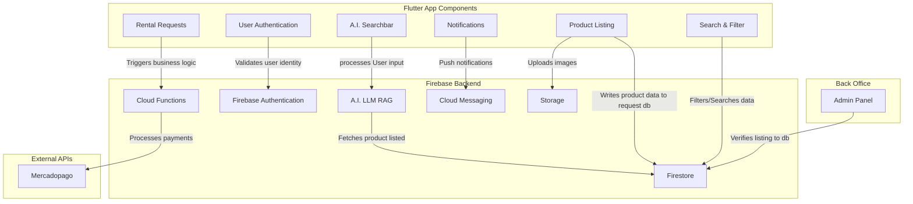
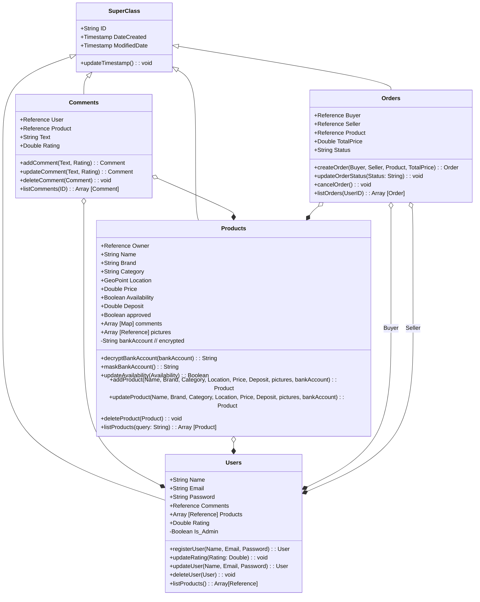
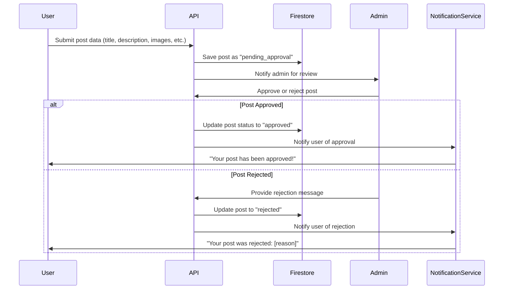
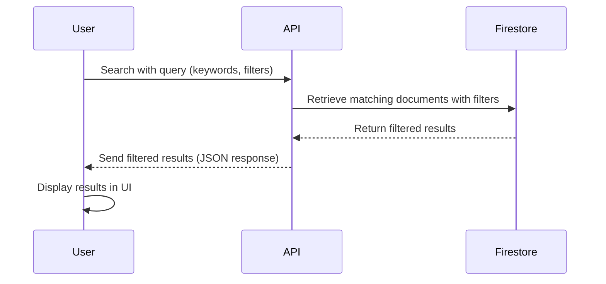
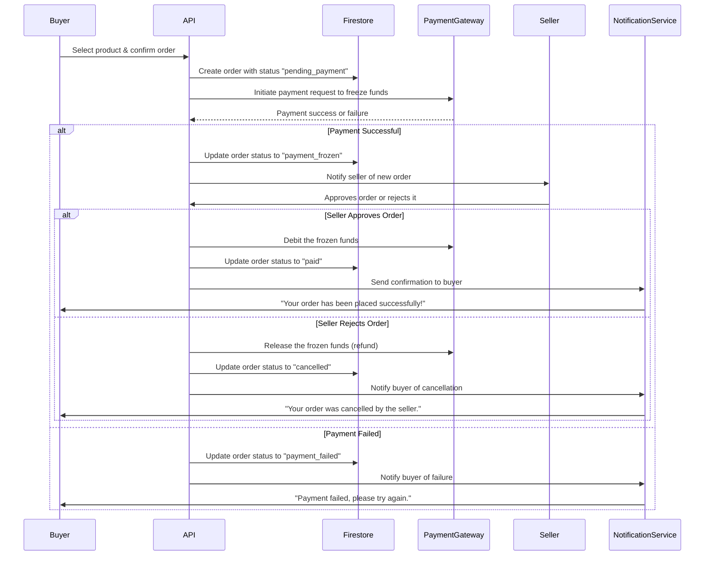

# ALKILATE Technical Documentation

# **Stories and Mockups**

## User Stories

- As a logged-in user, I want to view the status (active, paused, or pending approval) of products registered under my account for renting so that I can manage their status effectively and take appropriate actions.
- As a user, I want to filter and list products based on specific parameters (such as search radius, price, product name, brand, model, etc.) without needing to log in so that I can perform a quick search on the fly
- As an admin, I need to view pending product listing requests from regular users so that I can approve or reject them, ensuring incomplete submissions or terms-of-use violations are filtered out before the products are listed in the app.
- As a user, I want to ask about tools for a specific activity so that I can receive AI-based recommendations and a list of relevant products available in the app.

## Front-end


# **System Architecture**

### **Flutter:**

We chose Flutter for app development due to its cross-platform capabilities, enabling seamless deployment to both mobile and desktop environments from a single codebase. Flutter's robust ecosystem and large developer community provide access to well-established tools and libraries, simplifying the integration of essential features such as database management, authentication, and other functionalities. Additionally, Flutter's hot-reload feature significantly accelerates the development process, allowing for real-time updates and faster iteration. Its modern UI framework ensures a consistent and visually appealing user experience across all platforms, making it an ideal choice for our project's scalability and long-term maintainability.

---

### **Google Cloud Platform (GCP):**

We selected Google Cloud Platform for our backend and database infrastructure due to its robust support for authentication, NoSQL databases (such as Firestore), and seamless integration with AI tools like Gemini. Given the unstructured nature of our product data, GPC's flexible NoSQL solutions provide an ideal fit for efficient data management and scalability. GCP's global infrastructure ensures high availability, low latency, and reliable performance, which are critical for delivering a smooth user experience. Additionally, GCP's native compatibility with Flutter and Dart ensures smooth integration, streamlining development and enhancing overall project efficiency. The platform's pay-as-you-go pricing model also offers cost-effectiveness, allowing us to scale resources as needed without incurring unnecessary expenses.

---



# **Classes, and Database Design**

## Class design



## Database

# Firestore Database Structure

## `users` (Collection)
- **`userId`** (Document)
  - **Fields**:
    - `name`
    - `email`
    - `createdAt`
  - **Subcollections**:
    - **`orders`** (Subcollection)
      - **`orderId`** (Document)
        - **Fields**:
          - `ownerID`
          - `productID`
          - `totalAmount`
          - `status`
          - `createdAt`
    - **`Products`** (Subcollection)
      - **`productID`** (Document)
        - **Fields**:
          - `name`
          - `status`
          - `thumbnail`
          - `price`
          - `availability`

---

## `products` (Collection)
- **`productID`** (Document)
  - **Fields**:
    - `name`
    - `description`
    - `ownerID`
    - `location`
    - `price`
    - `deposit`
    - `category`
    - `brand`
    - `availability`
    - `status`
    - `bankAccount`
    - `createdAt`
  - **Subcollections**:
    - **`reviews`** (Subcollection)
      - **`reviewId`** (Document)
        - **Fields**:
          - `userId`
          - `rating`
          - `comment`
          - `createdAt`

---

## `orders` (Collection)
- **`orderID`** (Document)
  - **Fields**:
    - `userID`
    - `ownerID`
    - `productID`
    - `totalAmount`
    - `status`
    - `availability`
    - `createdAt`

# **High-Level Sequence Diagrams**

## Posting Diagram:



## Searching Diagram:



## Buying Diagram:



# **External and Internal APIs**

## External APIs

- Mercado Pago
- Firebase Cloud Messaging
- Firebase Authentication
- **Firebase Firestore**

## Internal APIs

# Users

## **Get a Single User**

### **Endpoint**

- **URL Path:** `/users/{userId}`
- **HTTP Method:** `GET`

---

### **Description**

This endpoint retrieves the details of a specific user by their unique ID. It returns information such as the user's `name` and `email`.

---

### **Request**

### **URL Parameters**

| **Parameter** | **Type** | **Description** |
| --- | --- | --- |
| `userId` | string | The unique ID of the user to retrieve. |

---

### **Request Example**

```
GET /users/12345
```

---

### **Response**

### **Success Response**

- **Status Code:** `200 OK`
- **Response Format:** JSON
- **Response Body:**
    
    ```json
    {
        "name": "John Doe",
        "email": "john.doe@example.com",
    }
    ```
    

### **Fields Description**

| **Field** | **Type** | **Description** |
| --- | --- | --- |
| `name` | string | The full name of the user. |
| `email` | string | The email address of the user. |

---

## **Create a New User**

### **Endpoint**

- **URL Path:** `/users`
- **HTTP Method:** `POST`

---

### **Description**

This endpoint creates a new user in the system. It accepts user details such as `name` and `email` and returns the unique ID of the newly created user.

---

### **Request**

### **Request Body Format**

- **Content-Type:** `application/json`
- **Request Body (JSON):**
    
    ```json
    {
        "name": "New User",
        "email": "new.user@example.com",
    }
    ```
    

### **Fields Description**

| **Field** | **Type** | **Description** |
| --- | --- | --- |
| `name` | string | The full name of the user. |
| `email` | string | The email address of the user. |

---

### **Request Example**

```
POST /users
Content-Type: application/json
{
  "name": "New User",
  "email": "new.user@example.com"
}
```

---

### **Response**

### **Success Response**

- **Status Code:** `201 Created`
- **Response Format:** JSON
- **Response Body:**
    
    ```json
    {
        "id": "new_user_id",
    }
    ```
    

### **Fields Description**

| **Field** | **Type** | **Description** |
| --- | --- | --- |
| `id` | string | The unique ID of the newly created user. |

---

## **List Orders for a User**

### **Endpoint**

- **URL Path:** `/users/{userId}/orders`
- **HTTP Method:** `GET`

---

### **Description**

This endpoint retrieves a list of all orders associated with a specific user. It can be used to display orders made by a user (as a buyer) or orders received by a user (as a seller).

---

### **Request**

### **URL Parameters**

| **Parameter** | **Type** | **Description** |
| --- | --- | --- |
| `userId` | string | The unique ID of the user whose orders are being retrieved. |

### **Query Parameters**

| **Parameter** | **Type** | **Description** |
| --- | --- | --- |
| `limit` | number | (Optional) The maximum number of orders to return. Default: 10. |
| `offset` | number | (Optional) The number of orders to skip for pagination. Default: 0. |
| `role` | string | (Optional) Filter orders by the user's role (`buyer` or `seller`). If not provided, all orders associated with the user are returned. |

---

### **Request Example**

```
GET /users/12345/orders?limit=5&offset=10&role=buyer
```

---

### **Response**

### **Success Response**

- **Status Code:** `200 OK`
- **Response Format:** JSON
- **Response Body:**
    
    ```json
    [
        {
            "id": "order_id_1",
            "buyer": "user_id",
            "seller": "user_id",
            "product": "product_id",
            "total_price": 1000,
            "status": "completed",
            "order_date": "2025-01-15T00:00:00Z",
        },
        {
            "id": "order_id_2",
            "buyer": "user_id",
            "seller": "user_id",
            "product": "product_id",
            "total_price": 500,
            "status": "pending",
            "order_date": "2025-01-20T00:00:00Z",
        }
    ]
    
    ```
    

**Fields Description**

| **Field** | **Type** | **Description** |
| --- | --- | --- |
| `id` | string | The unique ID of the order. |
| `buyer` | string | The ID of the user who placed the order (buyer). |
| `seller` | string | The ID of the user who sold the product (seller). |
| `product` | string | The ID of the product associated with the order. |
| `total_price` | number | The total price of the order. |
| `status` | string | The status of the order (e.g., `completed`, `pending`, `cancelled`). |
| `order_date` | string (ISO) | The timestamp when the order was placed. |

---

## **List Products from a User**

### **Endpoint**

- **URL Path:** `/users/{userId}/products`
- **HTTP Method:** `GET`

---

### **Description**

This endpoint retrieves a list of all products associated with a specific user. It is useful for displaying products owned by a user in their profile or dashboard.

---

### **Request**

### **URL Parameters**

| **Parameter** | **Type** | **Description** |
| --- | --- | --- |
| `userId` | string | The unique ID of the user whose products are being retrieved. |

### **Query Parameters**

| **Parameter** | **Type** | **Description** |
| --- | --- | --- |
| `limit` | number | (Optional) The maximum number of products to return. Default: 10. |
| `offset` | number | (Optional) The number of products to skip for pagination. Default: 0. |

---

### **Request Example**

```
GET /users/12345/products?limit=5&offset=10
```

---

### **Response**

### **Success Response**

- **Status Code:** `200 OK`
- **Response Format:** JSON
- **Response Body:**
    
    ```json
    [
        {
            "id": "product_id",
            "name": "Laptop",
            "price": 1000,
            "availability": true,
            "status": "Approved"
            "thumbnail": "http://picture.com",
        },
      ]
    ```
    

### **Fields Description**

| **Field** | **Type** | **Description** |
| --- | --- | --- |
| `id` | string | The unique ID of the product. |
| `name` | string | The name of the product. |
| `price` | number | The price of the product. |
| `availability` | boolean | Whether the product is currently available. |
| `status` | string | The status of the product (e.g., `Approved`, `Pending`, `Rejected`). |
| `thumbnail` | string (URL) | A link to the product's thumbnail image. |

---

# Admin

## **Get All Pending Products**

### **Endpoint**

- **URL Path:** `/admin/products/pending`
- **HTTP Method:** `GET`

---

### **Description**

This endpoint retrieves a list of all products that are currently in the `pending` status. It is intended for admin use to review and manage products awaiting approval.

---

### **Request**

### **Query Parameters**

| **Parameter** | **Type** | **Description** |
| --- | --- | --- |
| `limit` | number | (Optional) The maximum number of products to return. Default: 10. |
| `offset` | number | (Optional) The number of products to skip for pagination. Default: 0. |

---

### **Request Example**

```notion
GET /admin/products/pending?limit=5&offset=10
```

---

### **Response**

### **Success Response**

- **Status Code:** `200 OK`
- **Response Format:** JSON
- **Response Body:**

```json
[
   {
        "id": "product_id",
        "owner": "user_id",
        "name": "Laptop",
        "brand": "BrandName",
        "category": "Electronics",
        "price": 1000,
        "status": "pending",
        "created": "2025-01-15T00:00:00Z",
        "location": -123, -232,
        "deposit": 100,
        "pictures": "http://picture.com",
    }
]
```

### **Fields Description**

| **Field** | **Type** | **Description** |
| --- | --- | --- |
| `id` | string | The unique ID of the product. |
| `owner` | string | The ID of the product owner. |
| `name` | string | The name of the product. |
| `brand` | string | The brand of the product. |
| `category` | string | The category of the product. |
| `price` | number | The price of the product. |
| `status` | string | The status of the product (`pending`). |
| `created` | string (ISO) | The timestamp when the product was created. |
| `location` | array (number) | The geographic location of the product (latitude, longitude). |
| `deposit` | number | The deposit amount required for the product. |
| `pictures` | string (URL) | A link to the product's picture. |

---

## **Approve a Product**

### **Endpoint**

- **URL Path:** `/admin/products/{productId}/approve`
- **HTTP Method:** `POST`

---

### **Description**

This endpoint allows an admin to approve a product. Once approved, the product will be marked as `approved` in the system and made available for use or purchase.

---

### **Request**

### **URL Parameters**

| **Parameter** | **Type** | **Description** |
| --- | --- | --- |
| `productId` | string | The unique ID of the product to approve. |

---

### **Request Example**

```notion
POST /admin/products/12345/approve
```

---

### **Response**

### **Success Response**

- **Status Code:** `200 OK`
- **Response Format:** JSON
- **Response Body:**

```json
[
   {
        "id": "product_id",
        "owner": "user_id",
        "status": "approved",
    }
]
```

### **Fields Description**

| **Field** | **Type** | **Description** |
| --- | --- | --- |
| `id` | string | The unique ID of the approved product. |
| `owner` | string | The ID of the product owner. |
| `status` | string | The updated status of the product (`approved`). |

---

## **Reject a Product**

### **Endpoint**

- **URL Path:** `/admin/products/{productId}/reject`
- **HTTP Method:** `POST`

---

### **Description**

This endpoint allows an admin to reject a product and provide a rejection reason. The rejected product will be flagged in the system, and the owner of the product will be notified.

---

### **Request**

### **URL Parameters**

| **Parameter** | **Type** | **Description** |
| --- | --- | --- |
| `productId` | string | The unique ID of the product to reject. |

### **Query Parameters**

| **Parameter** | **Type** | **Description** |
| --- | --- | --- |
| `message` | string | The reason for rejecting the product. |

```notion
POST /admin/products/12345/reject?message=The%20product%20does%20not%20meet%20our%20quality%20standards.
```

### **Response**

### **Success Response**

- **Response Format:** JSON
- **Response Body:**
- **Status Code:** `200 OK`
    
    ```json
    [
    	{
    		"id": "msg_id",
    		"owner": "id",
        "rejection_reason": "The product does not meet our quality standards.",
    	}
    ]
    ```
    

### **Fields Description**

| **Field** | **Type** | **Description** |
| --- | --- | --- |
| `id` | string | The unique ID of the rejection message. |
| `owner` | string | The ID of the product owner. |
| `rejection_reason` | string | The reason for rejecting the product. |

# Product

## **Get All Products**

### **Endpoint**

- **URL Path:** `/products`
- **HTTP Method:** `GET`

---

### **Description**

This endpoint retrieves a list of all products in the system. It supports optional query parameters for filtering products by category, price range, and other criteria.

---

### **Request**

### **Query Parameters**

| **Parameter** | **Type** | **Description** |
| --- | --- | --- |
| `category` | string | (Optional) Filter products by category (e.g., `Electronics`). |
| `price_min` | number | (Optional) Filter products with a price greater than or equal to this value. |
| `price_max` | number | (Optional) Filter products with a price less than or equal to this value. |
| `availability` | boolean | (Optional) Filter products by availability (`true` or `false`). |
| `limit` | number | (Optional) The maximum number of products to return. Default: 10. |
| `offset` | number | (Optional) The number of products to skip for pagination. Default: 0. |

---

### **Request Example**

```
GET /products?category=Electronics&price_min=500&price_max=1000&availability=true&limit=5&offset=10
```

---

### **Response**

### **Success Response**

- **Status Code:** `200 OK`
- **Response Format:** JSON
- **Response Body:**
    
    ```json
    [
        {
            "id": "product_id",
            "name": "Laptop",
            "brand": "BrandName",
            "category": "Electronics",
            "price": 1000,
            "availability": true,
            "location": -123, -232,
            "deposit": 100,
            "pictures": ["https://www.test.com/OIP.7h5LkgHaEK?"],
        },
        {
            "id": "product_id_2",
            "name": "Phone",
            "brand": "AnotherBrand",
            "category": "Electronics",
            "price": 500,
            "availability": false,
            "location": -123, -232,
            "deposit": 100,
            "pictures": ["https://www.test.com/OIP.7h5LkgHaEK?"],
        }
    ]
    ```
    

### **Fields Description**

| **Field** | **Type** | **Description** |
| --- | --- | --- |
| `id` | string | The unique ID of the product. |
| `name` | string | The name of the product. |
| `brand` | string | The brand of the product. |
| `category` | string | The category of the product. |
| `price` | number | The price of the product. |
| `availability` | boolean | Whether the product is currently available. |
| `location` | array (number) | The geographic location of the product (latitude, longitude). |
| `deposit` | number | The deposit amount required for the product. |
| `pictures` | array (string) | A list of URLs to the product's pictures. |

---

## **Get a Single Product**

### **Endpoint**

- **URL Path:** `/products/{productId}`
- **HTTP Method:** `GET`

---

### **Description**

This endpoint retrieves the details of a specific product by its unique ID. It returns information such as the product's `name`, `brand`, `category`, `price`, `availability`, and more.

---

### **Request**

### **URL Parameters**

| **Parameter** | **Type** | **Description** |
| --- | --- | --- |
| `productId` | string | The unique ID of the product to retrieve. |

---

### **Request Example**

```
GET /products/12345
```

---

### **Response**

### **Success Response**

- **Status Code:** `200 OK`
- **Response Format:** JSON
- **Response Body:**
    
    ```json
        {
            "id": "product_id_2",
            "owner": "user_id_2",
            "name": "Phone",
            "brand": "AnotherBrand",
            "category": "Electronics",
            "price": 500,
            "availability": false,
            "status": "approved",
            "bankAccount": "account",
            "location": -123, -232,
            "deposit": 100,
            "pictures": ["https://www.test.com/OIP.7h5LkgHaEK?"],
            "comments": ["comment_id_4", "comment_id_3"]
        }
    ```
    

### **Fields Description**

| **Field** | **Type** | **Description** |
| --- | --- | --- |
| `id` | string | The unique ID of the product. |
| `owner` | string | The ID of the user who owns the product. |
| `name` | string | The name of the product. |
| `brand` | string | The brand of the product. |
| `category` | string | The category of the product. |
| `price` | number | The price of the product. |
| `availability` | boolean | Whether the product is currently available. |
| `status` | string | The status of the product (e.g., `approved`, `pending`, `rejected`). |
| `bankAccount` | string | The bank account associated with the product. |
| `location` | array (number) | The geographic location of the product (latitude, longitude). |
| `deposit` | number | The deposit amount required for the product. |
| `pictures` | array (string) | A list of URLs to the product's pictures. |
| `comments` | array (string) | A list of comment IDs associated with the product. |

---

## **Create a New Product**

### **Endpoint**

- **URL Path:** `/products`
- **HTTP Method:** `POST`

---

### **Description**

This endpoint creates a new product in the system. It accepts product details such as `name`, `brand`, `category`, `price`, and more, and returns the details of the newly created product.

---

### **Request**

### **Request Body Format**

- **Content-Type:** `application/json`
- **Request Body (JSON):**
    
    ```json
        {
            "owner": "user_id_2",
            "name": "Phone",
            "brand": "AnotherBrand",
            "category": "Electronics",
            "price": 500,
            "availability": false,
            "location": -123, -232,
            "deposit": 100,
            "pictures": ["https://www.test.com/OIP.7h5LkgHaEK?"]
        }
    ```
    

### **Fields Description**

| **Field** | **Type** | **Description** |
| --- | --- | --- |
| `owner` | string | The ID of the user who owns the product. |
| `name` | string | The name of the product. |
| `brand` | string | The brand of the product. |
| `category` | string | The category of the product. |
| `price` | number | The price of the product. |
| `availability` | boolean | Whether the product is currently available. |
| `location` | array (number) | The geographic location of the product (latitude, longitude). |
| `deposit` | number | The deposit amount required for the product. |
| `pictures` | array (string) | A list of URLs to the product's pictures. |

---

### **Request Example**

```
POST /products
Content-Type: application/json
{
  "owner": "user_id_2",
  "name": "Phone",
  "brand": "AnotherBrand",
  "category": "Electronics",
  "price": 500,
  "availability": false,
  "location": [-123, -232],
  "deposit": 100,
  "pictures": ["https://www.test.com/OIP.7h5LkgHaEK?"]
}
```

---

### **Response**

### **Success Response**

- **Status Code:** `201 Created`
- **Response Format:** JSON
- **Response Body:**
    
    ```json
        {
            "id": "product_id_2",
            "owner": "user_id_2",
            "name": "Phone",
            "brand": "AnotherBrand",
            "category": "Electronics",
            "price": 500,
            "availability": true,
            "approved": false,
            "location": -123, -232,
            "deposit": 100,
            "pictures": ["https://www.test.com/OIP.7h5LkgHaEK?"],
        }
    ```
    

### **Fields Description**

| **Field** | **Type** | **Description** |
| --- | --- | --- |
| `id` | string | The unique ID of the newly created product. |
| `owner` | string | The ID of the user who owns the product. |
| `name` | string | The name of the product. |
| `brand` | string | The brand of the product. |
| `category` | string | The category of the product. |
| `price` | number | The price of the product. |
| `availability` | boolean | Whether the product is currently available. |
| `status` | string | Whether the product has been approved by an admin. |
| `location` | array (number) | The geographic location of the product (latitude, longitude). |
| `deposit` | number | The deposit amount required for the product. |
| `pictures` | array (string) | A list of URLs to the product's pictures. |

---

## **Get All Comments for a Product**

### **Endpoint**

- **URL Path:** `/products/{productId}/comments`
- **HTTP Method:** `GET`
    
    ---
    

### **Description**

This endpoint retrieves a list of all comments associated with a specific product. It is useful for displaying user feedback and reviews for a product.

---

### **Request**

### **URL Parameters**

| **Parameter** | **Type** | **Description** |
| --- | --- | --- |
| `productId` | string | The unique ID of the product whose comments are being retrieved. |

### **Query Parameters**

| **Parameter** | **Type** | **Description** |
| --- | --- | --- |
| `limit` | number | (Optional) The maximum number of comments to return. Default: 10. |
| `offset` | number | (Optional) The number of comments to skip for pagination. Default: 0. |

---

### **Request Example**

```
GET /products/12345/comments?limit=5&offset=10
```

---

### **Response**

### **Success Response**

- **Status Code:** `200 OK`
- **Response Format:** JSON
- **Response Body:**
    
    ```json
    [
        {
            "id": "comment_id",
            "user": "user_id",
            "text": "Great product!",
            "rating": 5,
        },
        {
            "id": "comment_id_2",
            "user": "user_id_2",
            "text": "Not bad, but could be better.",
            "rating": 3,
        }
    ]
    ```
    

### **Fields Description**

| **Field** | **Type** | **Description** |
| --- | --- | --- |
| `id` | string | The unique ID of the comment. |
| `user` | string | The ID of the user who wrote the comment. |
| `text` | string | The text content of the comment. |
| `rating` | number | The rating given by the user (e.g., 1 to 5). |

---

## **Create a New Comment**

### **Endpoint**

- **URL Path:** `/products/{productId}/comments`
- **HTTP Method:** `POST`

---

### **Description**

This endpoint allows a user to create a new comment for a specific product. It accepts the comment details (e.g., `user`, `text`, `rating`) and returns the unique ID of the newly created comment.

---

### **Request**

### **URL Parameters**

| **Parameter** | **Type** | **Description** |
| --- | --- | --- |
| `productId` | string | The unique ID of the product to which the comment belongs. |

### **Request Body Format**

- **Content-Type:** `application/json`
- **Request Body (JSON):**
    
    ```json
    {
        "user": "user_id",
        "text": "This is a comment.",
        "rating": 4
    }
    ```
    

### **Fields Description**

| **Field** | **Type** | **Description** |
| --- | --- | --- |
| `user` | string | The ID of the user who is creating the comment. |
| `text` | string | The text content of the comment. |
| `rating` | number | The rating given by the user (e.g., 1 to 5). |

---

### **Request Example**

```
POST /products/12345/comments
Content-Type: application/json
{
  "user": "user_id",
  "text": "This is a comment.",
  "rating": 4
}
```

---

### **Response**

### **Success Response**

- **Status Code:** `201 Created`
- **Response Format:** JSON
- **Response Body:**
    
    ```json
    {
        "id": "new_comment_id",
    }
    ```
    

### **Fields Description**

| **Field** | **Type** | **Description** |
| --- | --- | --- |
| `id` | string | The unique ID of the newly created comment. |

---

# Order

## **Get Order by ID**

### **Endpoint**

- **URL Path:** `/orders/{orderId}`
- **HTTP Method:** `GET`

---

### **Description**

This endpoint retrieves the details of a specific order by its unique ID. It returns information such as the `buyer`, `seller`, `product`, `total_price`, `status`, and timestamps.

---

### **Request**

### **URL Parameters**

| **Parameter** | **Type** | **Description** |
| --- | --- | --- |
| `orderId` | string | The unique ID of the order to retrieve. |

---

### **Request Example**

```
GET /orders/12345
```

---

### **Response**

### **Success Response**

- **Status Code:** `200 OK`
- **Response Format:** JSON
- **Response Body:**
    
    ```json
    {
        "buyer": "user_id",
        "seller": "user_id",
        "product": "product_id",
        "total_price": 1000,
        "status": "pending",
    }
    ```
    

### **Fields Description**

| **Field** | **Type** | **Description** |
| --- | --- | --- |
| `id` | string | The unique ID of the order. |
| `buyer` | string | The ID of the user who placed the order (buyer). |
| `seller` | string | The ID of the user who sold the product (seller). |
| `product` | string | The ID of the product associated with the order. |
| `total_price` | number | The total price of the order. |
| `status` | string | The current status of the order (e.g., `pending`, `completed`, `cancelled`). |

---

## **Create an Order**

### **Endpoint**

- **URL Path:** `/orders`
- **HTTP Method:** `POST`

---

### **Description**

This endpoint allows a user to create a new order. It accepts details such as the `buyer`, `seller`, `product`, `total_price`, and `status`, and returns the details of the newly created order.

---

### **Request**

### **Request Body Format**

- **Content-Type:** `application/json`
- **Request Body (JSON):**
    
    ```json
    {
        "buyer": "user_id",
        "seller": "user_id",
        "product": "product_id",
        "total_price": 1000,
    }
    ```
    

### **Fields Description**

| **Field** | **Type** | **Description** |
| --- | --- | --- |
| `buyer` | string | The ID of the user placing the order (buyer). |
| `seller` | string | The ID of the user selling the product (seller). |
| `product` | string | The ID of the product being ordered. |
| `total_price` | number | The total price of the order. |

---

### **Request Example**

```
POST /orders
Content-Type: application/json
{
  "buyer": "user_id",
  "seller": "user_id",
  "product": "product_id",
  "total_price": 1000,
  "status": "pending"
}
```

---

### **Response**

### **Success Response**

- **Status Code:** `201 Created`
- **Response Format:** JSON
- **Response Body:**
    
    ```json
    {
        "id": "order_id",
        "buyer": "user_id",
        "seller": "user_id",
        "product": "product_id",
        "total_price": 1000,
        "status": "pending",
        }
    ```
    

### **Fields Description**

| **Field** | **Type** | **Description** |
| --- | --- | --- |
| `id` | string | The unique ID of the newly created order. |
| `buyer` | string | The ID of the user who placed the order (buyer). |
| `seller` | string | The ID of the user who sold the product (seller). |
| `product` | string | The ID of the product associated with the order. |
| `total_price` | number | The total price of the order. |
| `status` | string | The current status of the order (e.g., `pending`). |

---

## **Update Order Status**

### **Endpoint**

- **URL Path:** `/orders/{orderId}/status`
- **HTTP Method:** `PATCH`

---

### **Description**

This endpoint allows an admin or authorized user to update the status of an existing order. It accepts the new status (e.g., `completed`, `shipped`, `cancelled`) and returns the updated order details.

---

### **Request**

### **URL Parameters**

| **Parameter** | **Type** | **Description** |
| --- | --- | --- |
| `orderId` | string | The unique ID of the order to update. |

### **Request Body Format**

- **Content-Type:** `application/json`
- **Request Body (JSON):**
    
    ```json
    {
        "status": "completed"
    }
    ```
    

### **Fields Description**

| **Field** | **Type** | **Description** |
| --- | --- | --- |
| `status` | string | The new status of the order (e.g., `completed`, `shipped`, `cancelled`). |

---

### **Request Example**

```
PATCH /orders/12345/status
Content-Type: application/json
{
  "status": "completed"
}
```

---

### **Response**

### **Success Response**

- **Status Code:** `200 OK`
- **Response Format:** JSON
- **Response Body:**
    
    ```json
    {
        "id": "order_id",
        "buyer": "user_id",
        "seller": "user_id",
        "product": "product_id",
        "total_price": 1000,
        "status": "completed",
    }
    ```
    

### **Fields Description**

| **Field** | **Type** | **Description** |
| --- | --- | --- |
| `id` | string | The unique ID of the order. |
| `buyer` | string | The ID of the user who placed the order (buyer). |
| `seller` | string | The ID of the user who sold the product (seller). |
| `product` | string | The ID of the product associated with the order. |
| `total_price` | number | The total price of the order. |
| `status` | string | The updated status of the order. |

---

## **Cancel an Order**

### **Endpoint**

- **URL Path:** `/orders/{orderId}/cancel`
- **HTTP Method:** `POST`

---

### **Description**

This endpoint allows a user (buyer or seller) to cancel an existing order. It updates the order's status to `cancelled` and returns the updated order details.

---

### **Request**

### **URL Parameters**

| **Parameter** | **Type** | **Description** |
| --- | --- | --- |
| `orderId` | string | The unique ID of the order to cancel. |

---

### **Request Example**

http

Copy

```
POST /orders/12345/cancel
```

---

### **Response**

### **Success Response**

- **Status Code:** `200 OK`
- **Response Format:** JSON
- **Response Body:**
    
    ```json
    {
        "id": "order_id",
        "buyer": "user_id",
        "seller": "user_id",
        "product": "product_id",
        "total_price": 1000,
        "status": "cancelled",
        "order_date": "2025-01-15T00:00:00Z",
        "updated": "2025-01-16T18:00:00Z"
    }
    ```
    

### **Fields Description**

| **Field** | **Type** | **Description** |
| --- | --- | --- |
| `id` | string | The unique ID of the order. |
| `buyer` | string | The ID of the user who placed the order (buyer). |
| `seller` | string | The ID of the user who sold the product (seller). |
| `product` | string | The ID of the product associated with the order. |
| `total_price` | number | The total price of the order. |
| `status` | string | The updated status of the order (`cancelled`). |
| `order_date` | string (ISO) | The timestamp when the order was originally placed. |
| `updated` | string (ISO) | The timestamp when the order was last updated (e.g., when it was cancelled). |

---

# **SCM and QA Strategies**

We will use GitHub to centralize the project, facilitate teamwork, and manage branches. This approach will help maintain clear visibility and organization throughout the creation, implementation, and bug-fixing processes of the code.

## Strategy

The project will follow a branching strategy with four types of branches:

### Main:

This branch will always contain clean, fully functional, and finalized code that is ready for presentation.

### Dev:

The development work will be merged into this branch. All new features will be integrated into dev, once all features are complete and verified, it will be merged into main for deployment.

### Feature:

This branches will be created for an specific feature to develop, so to not generate multiple conflicts between developers. After the feature is finish it will be merged into the dev branch.

### Bug:

In case any bugs are found in the code, they will be fixed in this branch. The bug fixes will be merged into dev first for verification, and once the issue is resolved and tested, the changes will be merged into main.

## Workflow

- Cloning the Repository:
- Each team member will clone the project repository to their local development environment.
- Feature Development:
    
    When starting work on a new feature, developers will create a branch from dev
    
- Bug Fixes:
    
    If working on fixing a bug, the developer will create a branch from dev, to specifically a bug branch
    
- Commits:
Each commit must be descriptive and include a clear message to make it easy for the team to understand the changes made. This will facilitate team collaboration and ensure clarity.

---

### **Unit Testing**:

Each functionality will be tested individually to ensure it behaves as expected. This includes testing the logic behind features such as user registration, product rental, and payment processing.

### End to end testing:

Test the flow of a particular feature from beginning to end, from the user perspective. Checking that everything works as expected

### **Example Feature to Test: Placing an Order**

1. User logs in.
2. User browses products.
3. User adds a product to the cart.
4. User places an order.
5. Order is stored in Firestore.
6. Founds are freeze
7. Owner receives an order notification.
8. Owner approves
9. Founds are debited
10. User receives a message

• Use the Firebase Emulator to simulate Firestore, Authentication, and other Firebase services locally.
• Create test users, products, and other necessary data in the emulator.

Test edge cases, such as:

- Placing an order with a unavailable product.
- Placing an order without logging in.
- Users can see protected information
